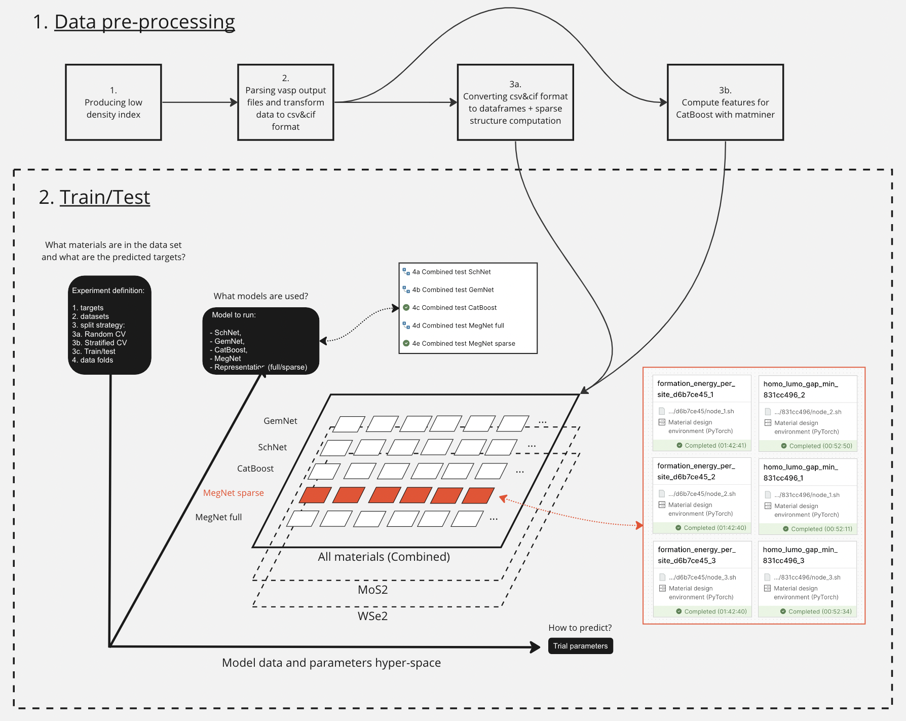

# Sparse representation for machine learning the properties of defects in 2D materials

*This Readme describes the computations needed to reproduce the paper. When switching between files in My Desk, Workflow Manager and other components of the platform, you can find this Readme by clicking on the question mark icon in the bottom right corner of the page.*

## Table of contents

- [Introduction](#introduction)
- [General pipeline](##Overview)
  - [Data preprocessing: VASP -\> csv/cif -\> pickle \& matminer](#data-preprocessing-vasp---csvcif---pickle--matminer)
    - [1. Low density index](#1-low-density-index)
    - [2. VASP -\> csv/cif](#2-vasp---csvcif)
    - [3a. csv/cif -\> dataframe](#3a-csvcif---dataframe)
    - [3b. csv/cif -\> matminer](#3b-csvcif---matminer)
  - [Models evaluation](#models-evaluation)
  - [Results analysis](#results-analysis)
  - [Data](#data)
- [Constructor Research Platform user guide](#user-guide)

# Reproducing the paper

> **Demo project**
> 
> This project uses lightweight workflows to demonstrate the functionality of a larger, more computationally intensive project. Certain computationally intensive steps have been omitted and replaced with pre-calculated data to reduce the computational requirements of this demo.
> 
>  The full version of the project, with all computationally intensive steps included, can be found [here](https://research.constructor.tech/public/project/6c2567e07ce64037b6b6edd2895b27ee). It requires approximately 16 GPU days to run. To get the resources, please contact us by clicking on the question mark icon in the bottom right corner of the page.
>
> To upgrade from a trial to full account, please contact us by clicking on the question mark icon in the bottom right corner of the page.

## Introduction

In the paper we propose sparse representation as a way to reduce the computational cost and improve the accuracy of machine learning the properties of defects in 2D materials. The code in the project implements the method, and a rigorous comparison of its performance to the a set of baselines.

Two-dimensional materials offer a promising platform for the next generation of (opto-) electronic devices and other high technology applications. One of the most exciting characteristics of 2D crystals is the ability to tune their properties via controllable introduction of defects. However, the search space for such structures is enormous, and ab-initio computations prohibitively expensive. We propose a machine learning approach for rapid estimation of the properties of 2D material given the lattice structure and defect configuration. The method suggests a way to represent  configuration of 2D materials with defects that allows a neural network to train quickly and accurately. We compare our methodology with the state-of-the-art approaches and demonstrate at least 3.7 times energy prediction error drop. Also, our approach is an order of magnitude more resource-efficient than its contenders both for the training and inference part.

The main idea of our method is using a point cloud of defects as an input to the predictive model, as opposed to the usual point cloud of atoms, or expertly created feature vector.


We compare our approach to state-of-the-art generic structure-property prediction algorithms: [GemNet](https://arxiv.org/abs/2106.08903), [SchNet](https://arxiv.org/abs/1706.08566), [MegNet](https://arxiv.org/abs/1812.05055), [matminer+CatBoost](https://github.com/hackingmaterials/matminer).

For dataset, we use [2DMD](https://www.nature.com/articles/s41699-023-00369-1). It consists of the most popular 2D materials: MoS2, WSe2, h-BN, GaSe, InSe, and black phosphorous (BP) with point defect density in the range of 2.5% to 12.5%. We use DFT to relax the structures and compute the defect formation energy and HOMO-LUMO gap. ML algorithms predict those quantities, taking unrelaxed structures as input.

## Overview 

The calculations in the paper occur in two stages:
1. Firstly, we extract the relevant information about the structures and their properties from the VASP outputs, and prepare the sparse and vectorized representation of the structures.
2. Secondly, we train the models and evaluate them on the test dataset.



Finally, we analyze the results and produce the tables and plots.

> To do computations we use Workflows. You can find more details about Workflow in [User guide](https://docs.constructor.tech/articles/constructor-research-platform-user-guide/managing-workflows).

## Data preprocessing: VASP -> csv/cif -> pickle & matminer

Run the workflows in the following order. Same number means the workflows can be run concurrently.

### 1. Low density index

This step creates technical files needed to preserve the historical structure indexing for low density structures. Output location: [`ai4material_design/datasets/csv_cif/low_density_defects_Innopolis-v1/{MoS2,WSe2}`](../datasets/csv_cif/low_density_defects_Innopolis-v1).

### 2. VASP -> csv/cif

This step extracts the computed energy and HOMO-LUMO gap values from the raw VASP output, and saves the unrelaxed structures in a uniform way. Output location: [`ai4material_design/datasets/csv_cif/{high,low}_density_defects/*`](../datasets/csv_cif).

### 3a. csv/cif -> dataframe

This step converts the structures from standard [CIF](https://www.iucr.org/resources/cif) format to a fast platform-specific pickle storage. It also preprocesses the target values, e. g. computes the formation energy per site. Finally, it produces the sparse defect-only representations.

Output location: [`ai4material_design/datasets/processed/{high,low}_density_defects/*/{targets.csv,data.pickle}.gz`](../datasets/processed).

### 3b. csv/cif -> matminer

This step computes [matminer](https://github.com/hackingmaterials/matminer) descriptors, to be used with [CatBoost](https://catboost.ai/). You can skip this step if don't plan on running CatBoost.

Output location: [`ai4material_design/datasets/processed/{high,low}_density_defects/*/matminer.csv.gz`](../datasets/processed).

## Models evaluation

We train the models on the training dataset and produce predictions on the test dataset. The training and testing datasets are uniformly sampled from 2DMD, stratified with the respect to base material. Training for each model is done 12 times with different random seeds and initializations to estimate the uncertainty.

Run the following workflows concurrently:
* `4a Combined test SchNet`
* `4b Combined test GemNet`
* `4c Combined test CatBoost`
* `4d Combined test MegNet full`
* `4e Combined test MegNet sparse`

Output location: [`ai4material_design/datasets/predictions/combined_mixed_weighted_test/**`](../datasets/predictions/combined_mixed_weighted_test).


## Results analysis
The notebooks are used as a source for CRP Publications, to update go to the "Publications" tab, click "Synchronize" and "Publish"
* Aggregate performance tables [`ai4material_design/notebooks/Results tables.ipynb`](../notebooks/Results%20tables.ipynb)
* Quantum oscillation predictions [`ai4material_design/notebooks/MoS2_V2_plot.ipynb`](../notebooks/MoS2_V2_plot.ipynb)

Additionally, the aggregate tables can be produced in CSV format with
```bash
cd ai4material_design
python scripts/summary_table_lean.py --experiment combined_mixed_weighted_test --targets formation_energy_per_site --stability-trials stability/schnet/25-11-2022_16-52-31/71debf15 stability/catboost/29-11-2022_13-16-01/02e5eda9 stability/gemnet/16-11-2022_20-05-04/b5723f85 stability/megnet_pytorch/sparse/05-12-2022_19-50-53/d6b7ce45 stability/megnet_pytorch/25-11-2022_11-38-18/1baefba7 --separate-by target --column-format-re stability\/\(?P\<name\>.+\)\/.+/\.+ --paper-results --multiple 1000 --format pandas_separate_std
python scripts/summary_table_lean.py --experiment combined_mixed_weighted_test --targets homo_lumo_gap_min --stability-trials stability/schnet/25-11-2022_16-52-31/2a52dbe8 stability/catboost/29-11-2022_13-16-01/1b1af67c stability/gemnet/16-11-2022_20-05-04/c366c47e stability/megnet_pytorch/sparse/05-12-2022_19-50-53/831cc496 stability/megnet_pytorch/25-11-2022_11-38-18/1baefba7 --separate-by target --column-format-re stability\/\(?P\<name\>.+\)\/.+/\.+ --paper-results --multiple 1000 --format pandas_separate_std
```

## Data
The data are already here at [`ai4material_design/datasets`](../datasets) The results of all the steps are already available in the repository, you can selectively reproduce the parts you want.

## User guide
You can find more details about Constructor Research Platform functionality in the documentation [here](https://docs.constructor.tech/articles/?readerUiPreview=1#!constructor-research-platform-user-guide/about-this-guide)
