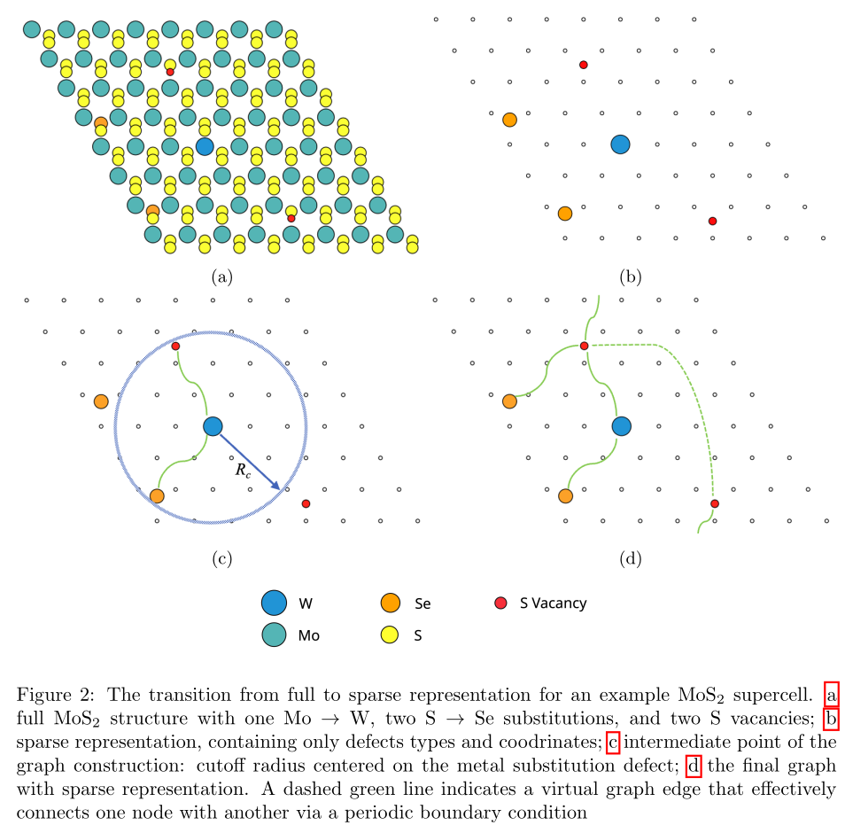
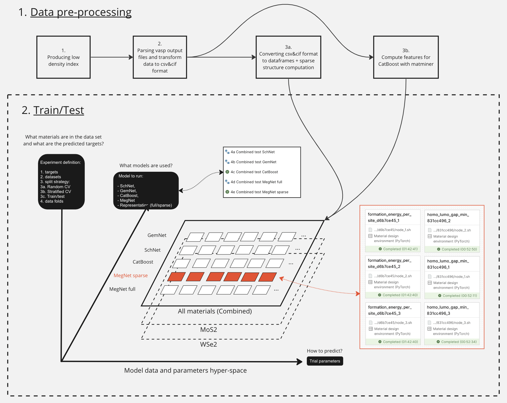

# Sparse representation for machine learning the properties of defects in 2D materials

*This Readme describes the computations needed to reproduce the paper. When switching between files in My Desk, Workflow Manager and other components of the platform, you can find this Readme by clicking on the question mark icon in the bottom right corner of the page.*

## Table of contents

- [Introduction](#introduction)
- [Inference](#inference)
- [Paper Overview](#paper-overview)
  - [Data preprocessing: VASP -\> csv/cif -\> pickle \& matminer](#data-preprocessing-vasp---csvcif---pickle--matminer)
    - [1. Low density index](#1-low-density-index)
    - [2. VASP -\> csv/cif](#2-vasp---csvcif)
    - [3a. csv/cif -\> dataframe](#3a-csvcif---dataframe)
    - [3b. csv/cif -\> matminer](#3b-csvcif---matminer)
  - [Models evaluation](#models-evaluation)
  - [Results analysis](#results-analysis)
  - [Final model training](#final-model-training)
  - [Data](#data)
- [Citation](#citation)
- [Constructor Research Platform user guide](#user-guide)

# Reproducing the paper

## Introduction
In the paper we propose sparse representation as a way to reduce the computational cost and improve the accuracy of machine learning the properties of defects in 2D materials. The code in the project implements the method, and a rigorous comparison of its performance to the a set of baselines.

Two-dimensional materials offer a promising platform for the next generation of (opto-) electronic devices and other high technology applications. One of the most exciting characteristics of 2D crystals is the ability to tune their properties via controllable introduction of defects. However, the search space for such structures is enormous, and ab-initio computations prohibitively expensive. We propose a machine learning approach for rapid estimation of the properties of 2D material given the lattice structure and defect configuration. The method suggests a way to represent  configuration of 2D materials with defects that allows a neural network to train quickly and accurately. We compare our methodology with the state-of-the-art approaches and demonstrate at least 3.7 times energy prediction error drop. Also, our approach is an order of magnitude more resource-efficient than its contenders both for the training and inference part.

The main idea of our method is using a point cloud of defects as an input to the predictive model, as opposed to the usual point cloud of atoms, or expertly created feature vector.


We compare our approach to state-of-the-art generic structure-property prediction algorithms: [GemNet](https://arxiv.org/abs/2106.08903), [SchNet](https://arxiv.org/abs/1706.08566), [MegNet](https://arxiv.org/abs/1812.05055), [matminer+CatBoost](https://github.com/hackingmaterials/matminer).

For dataset, we use [2DMD](https://www.nature.com/articles/s41699-023-00369-1). It consists of the most popular 2D materials: MoS2, WSe2, h-BN, GaSe, InSe, and black phosphorous (BP) with point defect density in the range of 2.5% to 12.5%. We use DFT to relax the structures and compute the defect formation energy and HOMO-LUMO gap. ML algorithms predict those quantities, taking unrelaxed structures as input.

## Inference
The pre-trained models are available in the repository. Notebook showing the usage of the models for predictions, along with data generation, and saving to Data catalog is [here](../notebooks/Inference.ipynb) 

## Paper Overview

> This project requires substantial computational resources, around 16 GPU days. If you haven't already upgraded from a trial to full account, please contact us by clicking on the question mark icon in the bottom right corner of the page.

The calculations in the paper occur in two stages:
1. Firstly, we extract the relevant information about the structures and their properties from the VASP outputs, and prepare the sparse and vectorized representation of the structures.
2. Secondly, we train the models and evaluate them on the test dataset.



Finally, we analyze the results and produce the tables and plots.

The results of all the steps are already available in the repository, you can selectively reproduce the parts you want.
## Technical notes
### Terminal
Open a terminal using the Desk menu. The commands in this guide assume the starting working directory to be `/home/coder/project` .
### WanDB
[WanDB](https://wandb.ai/) is a service for monitoring and recording machine learning experiments we use in the project. By default, WanDB integration is disabled. To optionally enable it, set you WanDB API key in [`scripts/Rolos/wandb_config.sh`](../scripts/Rolos/wandb_config.sh), commit and push. Note that if you add collaborators to your project, they will have access to your API key.
### Workflows
To do computations we use Workflows. You can find more details about Workflow in [User guide](https://docs.constructor.tech/articles/constructor-research-platform-user-guide/managing-workflows). You might also want to open the workflows interface in a different browser tab, usually accomplished with Ctrl-click. After running a workflow, you need to grab the outputs from the workflow and add them to git:
```bash
export WORKFLOW="<workflow name>"
# Example:
# export WORKFLOW="4e Combined test MegNet sparse"
cp -r "rolos_workflow_data/${WORKFLOW}/current/data/datasets" ai4material_design/
git add ai4material_design/datasets
git commit -m "Workflow ${WORKFLOW} results"
git push
```
### The data are already here
The results of all the steps are already available in the repository, you can selectively reproduce the parts you want.
# Reproducing the paper
## Introduction
In the paper we propose sparse representation as a way to reduce the computational cost and improve the accuracy of machine learning the properties of defects in 2D materials. The code in the project implements the method, and a rigorous comparison of its performance to the a set of baselines.

The calculations in the paper occur in three stages. Firstly, we extract the relevant information about the structures and their properties from the VASP outputs, and prepare the sparse and vectorized representation of the structures. Secondly, we train the models and evaluate them on the test dataset. Finally, we analyze the results and produce the tables and plots.
## Data preprocessing: VASP -> csv/cif -> pickle & matminer

Run the workflows in the following order. Same number means the workflows can be run concurrently.

### 1. Low density index

This step creates technical files needed to preserve the historical structure indexing for low density structures. Output location: [`ai4material_design/datasets/csv_cif/low_density_defects_Innopolis-v1/{MoS2,WSe2}`](../datasets/csv_cif/low_density_defects_Innopolis-v1).

### 2. VASP -> csv/cif

This step extracts the computed energy and HOMO-LUMO gap values from the raw VASP output, and saves the unrelaxed structures in a uniform way. Output location: [`ai4material_design/datasets/csv_cif/{high,low}_density_defects/*`](../datasets/csv_cif).

To reduce the repository size, raw VASP files are not stored on the Constructor Research Platform, you need to download them from the external storage via [DVC](https://dvc.org/) and add them to [Git LFS](https://git-lfs.com/) which Constructor Research Platform uses to share the data with workflows and collaborators. Prior to that, you need to increase the project size (100 Gb), CPU cores (4), and RAM (16 Gb). Make sure you have a full, and not a trial account, then left-click on the environment name, "Material design environment (PyTorch)" in our case.

Due to the large size and number of files, the operation might take 10-20 minutes. Use the following commands:
```bash
cd ai4material_design
dvc pull datasets/raw_vasp/high_density_defects/{BP,GaSe,hBN,InSe}_spin*.dvc
dvc pull datasets/raw_vasp/high_density_defects/{MoS,WSe}2_500.dvc

git config --global pack.threads "4"
git add datasets/raw_vasp/high_density_defects/{BP,GaSe,hBN,InSe}_spin*
git add datasets/raw_vasp/high_density_defects/{MoS,WSe}2_500
git commit -m "Add raw VASP files for the high-density datasets"
git push
```

Note that on CRP the the low density defects processing doesn't work (two nodes will fail), see the notes below.

#### Note on low-density datasets
The low density defects processing relies on [FUSE](https://www.kernel.org/doc/html/next/filesystems/fuse.html) to mount the data archives, which is not available on CRP, and can not be installed inside Docker. If absolutely necessary, unpack the archives, they would take around 300 Gb. The archives are also in DVC and can be downloaded with the following commands:

```bash
cd ai4material_design
dvc pull datasets/raw_vasp/dichalcogenides8x8_vasp_nus_202110/*.tar.gz.dvc

git config --global pack.threads "4"
git add datasets/raw_vasp/dichalcogenides8x8_vasp_nus_202110/*.tar.gz
git commit -m "Add raw VASP files for the low-density datasets"
git push
```

### 3a. csv/cif -> dataframe
This step converts the structures from standard [CIF](https://www.iucr.org/resources/cif) format to a fast platform-specific pickle storage. It also preprocesses the target values, e. g. computes the formation energy per site. Finally, it produces the sparse defect-only representations.

Output location: [`ai4material_design/datasets/processed/{high,low}_density_defects/*/{targets.csv,data.pickle}.gz`](../datasets/processed).
### 3b. csv/cif -> matminer

This step computes [matminer](https://github.com/hackingmaterials/matminer) descriptors, to be used with [CatBoost](https://catboost.ai/). Assuming the resources are available, the step takes around 3 days, you can skip it if you don't plan on running CatBoost. Output Location: [`ai4material_design/datasets/processed/{high,low}_density_defects/*/matminer.csv.gz`](../datasets/processed).
## Models evaluation
We train the models on the training dataset and produce predictions on the test dataset. The training and testing datasets are uniformly sampled from 2DMD, stratified with the respect to base material. Training for each model is done 12 times with different random seeds and initializations to estimate the uncertainty.

Open the Workflow interface by clicking on the Workflow link in the top-right. Run them concurrently:
* `4a Combined test SchNet`
* `4b Combined test GemNet`
* `4c Combined test CatBoost`
* `4d Combined test MegNet full`
* `4e Combined test MegNet sparse`
Output location: [`ai4material_design/datasets/predictions/combined_mixed_weighted_test/**`](../datasets/predictions/combined_mixed_weighted_test).

## Results analysis
The notebooks are used as a source for CRP Publications, to update go to the "Publications" tab, click "Synchronize" and "Publish"
* Aggregate performance tables [`ai4material_design/notebooks/Results tables.ipynb`](../notebooks/Results%20tables.ipynb)
* Quantum oscillation predictions [`ai4material_design/notebooks/MoS2_V2_plot.ipynb`](../notebooks/MoS2_V2_plot.ipynb)

Additionally, the aggregate tables can be produced in CSV format with
```bash
cd ai4material_design
python scripts/summary_table_lean.py --experiment combined_mixed_weighted_test --targets formation_energy_per_site --stability-trials stability/schnet/25-11-2022_16-52-31/71debf15 stability/catboost/29-11-2022_13-16-01/02e5eda9 stability/gemnet/16-11-2022_20-05-04/b5723f85 stability/megnet_pytorch/sparse/05-12-2022_19-50-53/d6b7ce45 stability/megnet_pytorch/25-11-2022_11-38-18/1baefba7 --separate-by target --column-format-re stability\/\(?P\<name\>.+\)\/.+/\.+ --paper-results --multiple 1000 --format pandas_separate_std
python scripts/summary_table_lean.py --experiment combined_mixed_weighted_test --targets homo_lumo_gap_min --stability-trials stability/schnet/25-11-2022_16-52-31/2a52dbe8 stability/catboost/29-11-2022_13-16-01/1b1af67c stability/gemnet/16-11-2022_20-05-04/c366c47e stability/megnet_pytorch/sparse/05-12-2022_19-50-53/831cc496 stability/megnet_pytorch/25-11-2022_11-38-18/1baefba7 --separate-by target --column-format-re stability\/\(?P\<name\>.+\)\/.+/\.+ --paper-results --multiple 1000 --format pandas_separate_std
```
## Final model training
To train the models for inference on the whole [2DMD dataset](https://doi.org/10.1038/s41699-023-00369-1), including, training, testing and validation parts, run workflow `4f Training on the full dataset`. The weights will be saved to [`ai4material_design/datasets/checkpoints/combined_mixed_all_train/`](../datasets/checkpoints/combined_mixed_all_train/).
## Data
The data are at [`ai4material_design/datasets`](../datasets).

## Citation
Please cite the following two papers if you use the code or the data:
```
Kazeev, N., Al-Maeeni, A., Romanov I. et al. Sparse representation for machine learning the properties of defects in 2D materials. npj Comput Mater (2023). https://doi.org/10.1038/s41524-023-01062-z
```

```
Huang, P., Lukin, R., Faleev, M. et al. Unveiling the complex structure-property correlation of defects in 2D materials based on high throughput datasets. npj 2D Mater Appl 7, 6 (2023). https://doi.org/10.1038/s41699-023-00369-1
```

## User guide
You can find more details about Constructor Research Platform functionality in the documentation [here](https://docs.constructor.tech/articles/?readerUiPreview=1#!constructor-research-platform-user-guide/about-this-guide)
