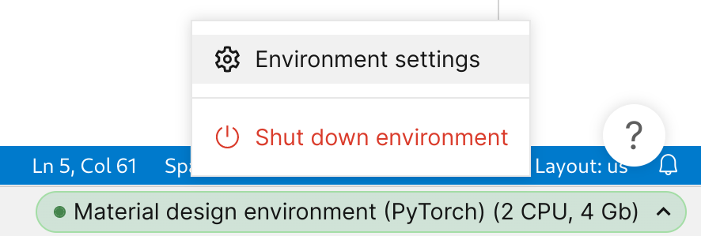

# Sparse representation for machine learning the properties of defects in 2D materials
[Pubic project link](https://my.rolos.com/public/project/6c2567e07ce64037b6b6edd2895b27ee)
# Constructor Research Platform survival guide
## Using terminal
Open a terminal using the Desk menu


The commands in this guide assume the starting working directory to be [`/home/coder/project`](/home/coder/project) .
## WanDB
[WanDB](https://wandb.ai/) is a service for monitoring and recording machine learning experiments we use in the project. By default, WanDB integration is disabled. To optionally enable it, set you WanDB API key in [`scripts/Rolos/wandb_config.sh`](../scripts/Rolos/wandb_config.sh), commit and push. Note that if you add collaborators to your project, they will have access to your API key.
## Using workflows
Open the Workflow interface by clicking on the Workflow link in the top-right. You might want to open it in a new browser tab.


After running a workflow, you need to grab the outputs from the workflow and add them to git:
```bash
export WORKFLOW="<workflow name>"
# Example:
# export WORKFLOW="4 Combined test MegNet sparse"
cp -r "rolos_workflow_data/${WORKFLOW}/current/data/datasets" ai4material_design/
git add ai4material_design/datasets
git commit -m "Workflow ${WORKFLOW} results"
git push
```
## The data are already here
The results of all the steps are already available in the repository, you can selectively reproduce the parts you want.
# Reproducing the paper
## Introduction
In the paper we propose sparse representation as a way to reduce the computational cost and improve the accuracy of machine learning the properties of defects in 2D materials. The code in the project implements the method, and a rigorous comparison of its performance to the a set of baselines.

The calculations in the paper occur in three stages. Firstly, we extract the relevant information about the structures and their properties from the VASP outputs, and prepare the sparse and vectorized representation of the structures. Secondly, we train the models and evaluate them on the test dataset. Finally, we analyze the results and produce the tables and plots.
## Data preprocessing
Data preprocessing occurs in stages:
1. VASP -> csv/cif extracts the computed energy and HOMO-LUMO gap values from the raw VASP output, and saves the unrelaxed structures in a uniform way.
2. csv/cif -> dataframe converts the structures from standard [CIF](https://www.iucr.org/resources/cif) format to a fast platform-specific pickle storage. It also preprocesses the target values, e. g. computes the formation energy per atom. Finally, it produces the sparse defect-only representations.
3. csv/cif -> matminer computes [matminer](https://github.com/hackingmaterials/matminer) descriptors, to be used with [CatBoost](https://catboost.ai/).
### VASP -> csv/cif
To reduce the repository size, raw VASP files are not stored on the platform, you need to download them from DVC. Prior to that, you need to increase the project size, 100 Gb should be sufficient.
To increase the project size, make sure you have a full, and not a trial account, then left-click on the environment name, "Material design environment (PyTorch)" in our case.


Use the following commands to download the data from DVC:
```bash
cd ai4material_design
dvc pull datasets/raw_vasp/high_density_defects/{BP,GaSe,hBN,InSe}_spin*.dvc
dvc pull datasets/raw_vasp/high_density_defects/{MoS,WSe}2_500.dvc
dvc pull datasets/raw_vasp/dichalcogenides8x8_vasp_nus_202110/*.tar.gz.dvc

git add datasets/raw_vasp/high_density_defects/{BP,GaSe,hBN,InSe}_spin*
git add datasets/raw_vasp/high_density_defects/{MoS,WSe}2_500
git add datasets/raw_vasp/dichalcogenides8x8_vasp_nus_202110/*.tar.gz
git commit -m "Add raw VASP files"
git push
```
Run the workflows in the following order.
* `1 Low density index` creates technical files needed to preserve the historical structure indexing. Location: [`ai4material_design/datasets/csv_cif/low_density_defects_Innopolis-v1/{MoS2,WSe2}`](../datasets/csv_cif/low_density_defects_Innopolis-v1).
* `2 VASP to csv_cif` extracts the energy and band gap information from the raw VASP output. Location: [`ai4material_design/datasets/csv_cif/{high,low}_density_defects/*`](../datasets/csv_cif).
### csv/cif -> dataframe
Workflow `3 csv_cif to dataframe` converts the structures from standard [CIF](https://www.iucr.org/resources/cif) format to a fast platform-specific. It also preprocesses the target values, e. g. computes the formation energy per atom. Finally, it produces the sparse defect-only representations. Location: [`ai4material_design/datasets/processed/{high,low}_density_defects/*/{targets.csv,data.pickle}.gz`](../datasets/processed).
### csv/cif -> matminer
Workflow `3 Matminer` Assuming the resources are available, the step takes around 3 days, you can skip it if don't plan on running CatBoost. Location: [`ai4material_design/datasets/processed/{high,low}_density_defects/*/matminer.csv.gz`](../datasets/processed).
## Computational experiments
We have prepared the the workflows that reproduce the tuned models evaluation. They train the models and produce predictions on the test dataset. Training is done 12 times with different random seeds and initializations to estimate the uncertainty. Run them concurrently:
* `4 Combined test SchNet`
* `4 Combined test CatBoost`
* `4 Combined test MegNet full`
* `4 Combined test MegNet sparse`

Location: [`ai4material_design/datasets/predictions/combined_mixed_weighted_test/**`](../datasets/predictions/combined_mixed_weighted_test).

For the rest of computations in the paper, you need to create the corresponding workflows. 
## Results analysis
The notebooks are used as a source for Rolos publications, to update go to the "Publications" tab, click "Synchronize" and "Publish"
* Aggregate performance tables [`ai4material_design/notebooks/Results tables.ipynb`](../notebooks/Results%20tables.ipynb)
* Quantum oscillation predictions [`ai4material_design/notebooks/MoS2_V2_plot.ipynb`](../notebooks/MoS2_V2_plot.ipynb)

Additionally, the aggregate tables can be produced in CSV format with
```bash
cd ai4material_design
python scripts/summary_table_lean.py --experiment combined_mixed_weighted_test --targets formation_energy_per_site --stability-trials stability/schnet/25-11-2022_16-52-31/71debf15 stability/catboost/29-11-2022_13-16-01/02e5eda9 stability/gemnet/16-11-2022_20-05-04/b5723f85 stability/megnet_pytorch/sparse/05-12-2022_19-50-53/d6b7ce45 stability/megnet_pytorch/25-11-2022_11-38-18/1baefba7 --separate-by target --column-format-re stability\/\(?P\<name\>.+\)\/.+/\.+ --paper-results --multiple 1000 --format pandas_separate_std
python scripts/summary_table_lean.py --experiment combined_mixed_weighted_test --targets homo_lumo_gap_min --stability-trials stability/schnet/25-11-2022_16-52-31/2a52dbe8 stability/catboost/29-11-2022_13-16-01/1b1af67c stability/gemnet/16-11-2022_20-05-04/c366c47e stability/megnet_pytorch/sparse/05-12-2022_19-50-53/831cc496 stability/megnet_pytorch/25-11-2022_11-38-18/1baefba7 --separate-by target --column-format-re stability\/\(?P\<name\>.+\)\/.+/\.+ --paper-results --multiple 1000 --format pandas_separate_std
```

## Regenerating platform-specific scripts
The scripts and workflows are already on the platform. This section is for reference only.
### Data preprocessing
1. Generate the platform scripts from DVC
```bash
cd ai4material_design
./scripts/Rolos/generate_workflow_scrtipts_from_dvc.sh 8
```
2. Create the workflows
 - Create the workflows manually using the UI
 - Put your workflow and project ids to [`../scripts/Rolos/create_workflows.js`](../scripts/Rolos/create_workflows.js)
 - Log in to the platform, open the browser console, paste the relevant parts from [`../scripts/Rolos/create_workflows.js`](../scripts/Rolos/create_workflows.js). You need to do it for each workflow.
### Computational experiments
1. Generate the scripts:
```bash
cd ai4material_design/scripts/Rolos
xargs -a stability_trials.txt -L1 ./generate_experiments_workflow.sh 
```
2. Create the workflows
 -  Create the workflows manually using the UI
 - Put your workflow and project ids to [`../scripts/Rolos/create_workflows.js`](../scripts/Rolos/create_workflows.js)
 -  Log in to the platform, open the browser console, paste the relevant parts from [`../scripts/Rolos/create_workflows.js`](../scripts/Rolos/create_workflows.js). You need to do it for each workflow.